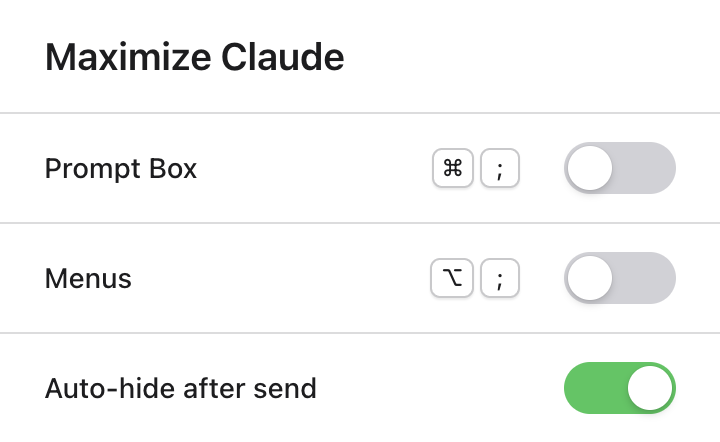

# Claude Screen Maximizer

A Chrome extension that reclaims screen real estate on [claude.ai](https://claude.ai). Hide the prompt box, sidebar, and menus with keyboard shortcuts — on both regular Claude chats and [Claude Code](https://claude.ai/code) sessions — so the conversation gets the whole screen.



## Features

- **Hide the prompt box** — collapses the composer/input area (and, on Claude Code, the "ready for next turn" indicator row) so a finished conversation reads like a document.
- **Hide the menus** — collapses the sidebar, top bar, conversation header, and share controls in one shortcut, and the chat expands to the full window width.
- **Auto-hide after send** — sending a message hides everything automatically, putting the response front and center. This is per-tab: it defaults **on** for regular chats and **off** for Claude Code sessions (where you usually want the prompt between turns), and you can flip it for any tab from the popup.
- **Custom shortcuts** — click a shortcut in the popup and type a new combo to rebind it. Shortcuts match physical keys, so Option-combos work correctly on macOS.
- **Live status icon** — the toolbar icon is tinted while the extension is actively hiding something, grey when everything is visible.

## Default shortcuts

| Shortcut (macOS) | Action |
|---|---|
| `⌘ ;` | Toggle the prompt box |
| `⌥ ;` | Toggle the sidebar and menus |

Restoring the prompt box automatically focuses the editor so you can keep typing immediately. Both shortcuts are rebindable in the popup, and the popup toggles mirror the page state in real time.

## Installation

1. Clone or download this repository
2. Open `chrome://extensions` in Chrome
3. Enable **Developer mode** (toggle in the top right)
4. Click **Load unpacked** and select the repository folder
5. Open [claude.ai](https://claude.ai) and press `⌥ ;`

## How it works

A content script runs on `claude.ai` pages and toggles a CSS class (with `!important` rules in `content.css`) on the target elements. A few design decisions worth noting:

- **Storage as the single source of truth.** The hidden/visible state of each feature lives in `chrome.storage.sync`. Keyboard shortcuts, popup toggles, and the toolbar icon all read and write the same keys, so every surface stays in sync — flip a toggle in the popup and the page reacts; press the shortcut on the page and the popup toggle moves.
- **Surviving re-renders.** Claude is a SPA that rebuilds its DOM constantly. A `MutationObserver` reapplies the hidden classes whenever hidden elements are re-created.
- **Per-tab auto-hide.** Unlike the hidden flags, the auto-hide setting is owned by each tab's content script and reset on page load. The popup reads and writes the active tab's value via `chrome.tabs.sendMessage`, so one tab's preference never leaks into another.
- **Physical-key shortcuts.** Matching uses `event.code` rather than `event.key`, because macOS transforms characters under Option (`⌥ ;` produces `…`) and `event.key`-based matching silently breaks.
- **Runtime-drawn icon.** The service worker renders the toolbar icon with `OffscreenCanvas` whenever the state changes.

## Project structure

```
├── manifest.json       # Manifest V3
├── content.js          # Shortcuts, element finders, hide/show state machine
├── content.css         # Hide rules and layout reclaim (width/padding overrides)
├── popup.html          # Popup UI: per-feature toggles + shortcut recorder
├── popup.js            # Popup logic, synced through chrome.storage
├── service_worker.js   # Draws the state-aware toolbar icon
└── icons/              # Static extension icons (16/48/128px)
```

## Privacy

The extension runs only on `claude.ai`, makes no network requests, and collects no data. The only stored values are your shortcut bindings and toggle states, kept in Chrome's extension storage.

## Caveats

This is an unofficial project, not affiliated with Anthropic. It depends on claude.ai's DOM structure, which changes without notice — if a shortcut stops working after a site redesign, the element selectors in `content.js` likely need updating.
